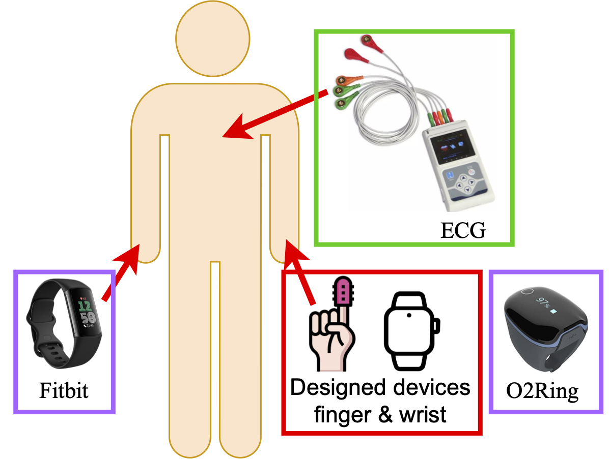

# UTSA-PPG: A comprehensive PPG-based dataset for HR/HRV studies

## Motivations

Heart rate (HR) and heart rate variability (HRV) are important vital signs for human physical and mental health. Recent research has demonstrated that photoplethysmography (PPG) sensors can infer HR and HRV. However, it is difficult to find a comprehensive PPG-based dataset for HR/HRV studies, especially for various study needs: multiple scenes, long-term monitoring, and multimodality (multiple PPG channels and extra acceleration data). Therefore, we collected a comprehensive multimodal long-term dataset to address the gap of missing an all-in-one HR/HRV dataset.

[Dataset Download Link](https://utsacloud-my.sharepoint.com/:f:/g/personal/jingye_xu_utsa_edu/EsLxz_7YuPVPihNOynhJgEgBX6kcbI1a5TL2DcTJJVsGoA)

## Devices

* ECG: a TLC5007 Dynamic 3-lead ECG holter requires five electrodes to be attached to the torso during data collection. It records the heart activity and stores it on the device
* Commercial devices: two commercial devices are selected to collect data simultaneously: Fitbit Charge 6 and O2Ring Continuous Oxygen Monitor
* Customized device: two PPG sensors, AST1041, are used to collect data on fingertip and wrist simultaneously as shown in the fugure. The left red rectangle shows a clip that goes around a finger, which contains a PPG sensor to record infrared (IR) and red light signals. The right red rectangle shows a wristband that contains a PPG sensor to record the green light signals. In addition, an accelerometer, AST1001, is added for our wristband.

## Data Collection Policy

Fifteen subjects participated in the study. However, three subjects’ data were abandoned due to system failure on the ECG devices, making our final dataset contain twelve subjects. Each subject followed a defined data collection protocol, including three different scenarios: sit, sleep, and office work. Each scenario was one data collection session that lasted for a minimum of 30 minutes and was collected separately, giving subjects time to rest during every two sessions. Before each data collection session, the timestamps of all devices were checked and synced to ensure that the time difference was as low as possible. When collecting data, subjects were required to follow the rules below for different scenarios:

* Sit: Subjects sit on a chair, putting hands on the desk,
with actions such as working with a laptop/smartphone,
talking to people, and drinking water.  
* Sleep: Subjects relax themselves and attempt to take a
nap in bed.  
* Office work: Besides the activities in the Sit scenario,
subjects would also involve walking activity.  

## Data Files Explained

The data files follow a naming strategy of `subject{id}_{scenario}_{source}.csv`

id: 1-12 for marking different subjects

scenario: office, sit, and sleep, covering the most common activities

source: ecg, fitbit, o2ring, and signals, the details are as follow:

  * ecg files: contains `time`, `rr`, `hr` three fields and can be groundtruth.
  * fitbit files: contains `time`, `hr`, `confidence` three fields.
  * o2ring files: contains `time` and `hr` fields.
  * signals files: contains `time`, `ir`, `red`, `green`, `x` , `y`, and `z` fields, which are time, infrared PPG signal channel from finger, red PPG signal channel from finger, green PPG signal channel from wrist, and three-axis accelerometer data.
  
## Citation

Please cite the following paper when using our dataset:

Jingye Xu, Yuntong Zhang, "A comprehensive PPG-based dataset for HR/HRV studies." ICHI 2025